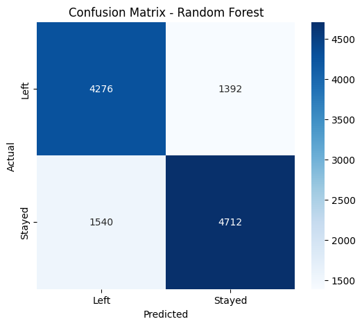
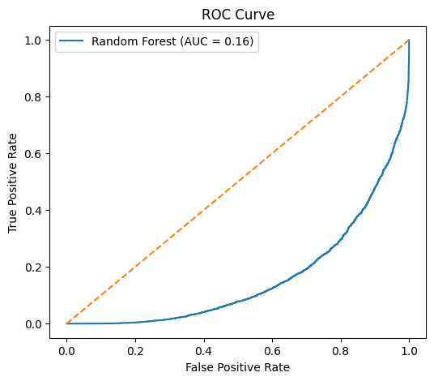
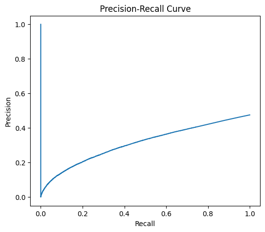
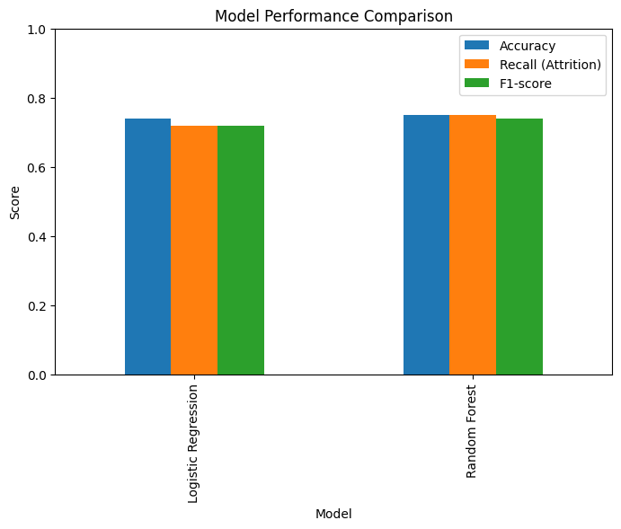
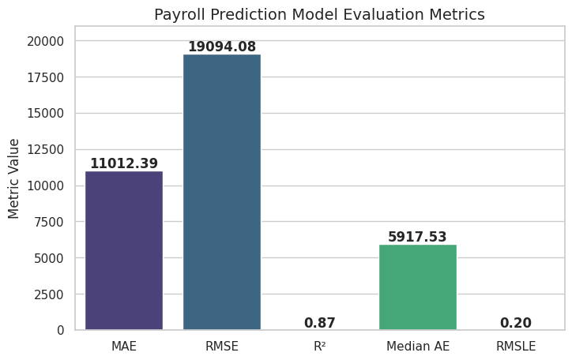

# Payroll_Sample_Project

This repository contains two end-to-end machine learning projects built on real-world HR and payroll-style data. The focus is on **practical problem solving**, **clean preprocessing**, and **business-oriented evaluation**, rather than just maximizing accuracy.

---

## Model 1: Employee Attrition Prediction (Classification)

###  Problem Statement

Predict whether an employee is likely to **leave the company (Attrition)** based on work environment, compensation, and personal factors. This is a classic HR analytics problem where **recall and business impact matter more than raw accuracy**.

###  Target Variable

* **Attrition**

  * `0` → Stayed
  * `1` → Left

###  Features Used
* Age
* Gender
* Years at Company
* Job Role
* Monthly Income
* Work-Life Balance
* Job Satisfaction
* Performance Rating
* Distance from Home
* Overtime
* Education Level
* Job Level
* Company Size
* Company Tenure
* Remote Work
* Employee Recognition

###  Data Preprocessing

* Numerical features → **StandardScaler**
* Ordinal categorical → **Ordinal Encoding**
* Nominal categorical → **One-Hot Encoding**
* Binary features → 0/1
* Pipelines and ColumnTransformer used to prevent data leakage

###  Models Implemented

1. **Logistic Regression (Baseline)**

   * Accuracy: ~74%
   * Recall (Attrition): ~72%

2. **Random Forest Classifier**

   * Accuracy: ~75%
   * Recall (Attrition): ~75%

### Evaluation Metrics

**Confusion Matrix**  

**ROC Curve**  

**Precision–Recall Curve**  

**Model Comparison**  

Focus was on **Recall**, since failing to identify employees likely to leave is costlier than false positives.

###  Key Insights

* Attrition is driven by multiple interacting factors, not a single dominant variable
* Non-linear models capture interactions and improve recall slightly over linear models
* Individual features show low linear correlation (<0.2) with attrition, typical in HR datasets

---

##  Tech Stack

* Python, Pandas, NumPy
* Scikit-learn
* CatBoost
* Matplotlib, Seaborn

---

## Model 2: Payroll Prediction (Regression)

###  Problem Statement

Predict an employee’s **Regular Pay** based on demographic, job-related, and organizational attributes. This helps organizations with salary planning, budgeting, and anomaly detection in payroll systems.

###  Target Variable

* **REGULAR_PAY** – Base salary to be predicted

###  Features Used

* **PAY_YEAR** – Year of payroll record
* **DEPARTMENT_NO** – Department identifier
* **JOB_CLASS_PGRADE** – Job class / pay grade
* **JOB_TITLE** – Employee job title
* **OVERTIME_PAY** – Overtime compensation
* **ALL_OTHER_PAY** – Additional earnings beyond base and overtime
* **CITY_RETIREMENT_CONTRIBUTIONS** – Employer retirement contribution
* **BENEFIT_PAY** – Total benefits cost
* **GENDER** – Employee gender
* **ETHNICITY** – Employee ethnicity

###  Data Preprocessing

* Categorical variables encoded using **LABEL ENCODING** 
* Numerical features scaled using **StandardScaler**
* Identifier columns (like Employee ID) removed
* Handled missing values if any

###  Model Implemented

* **CatBoost Regressor** – Tree-based gradient boosting model, handles categorical features natively, robust to non-linear patterns

###  Evaluation Metrics (approx.)

* MAE: $11,012
* RMSE: $19,094
* R²: 0.87
* Median Absolute Error: $5,917
* RMSLE: 0.204

**Visual Representation:**  

### Key Insights

* Job level, experience, and role hierarchy are the strongest predictors of pay
* CatBoost efficiently handles categorical variables without extensive preprocessing
* Tree-based models outperform linear models when job role and hierarchy are included

---

##  Project Highlights 

* **Built end-to-end ML workflows:** data cleaning → feature engineering → modeling → evaluation → visualization.  
* **Effectively handled categorical, ordinal, and numerical features,** including complex ones like job title and pay grade.  
* **Designed business-focused metrics,** emphasizing MAE, RMSE, R² for payroll and Recall/F1 for attrition.  
* **Implemented CatBoost for regression,** leveraging its native handling of categorical features for payroll prediction.  
* **Built Random Forest and Logistic Regression models for attrition,** focusing on actionable HR insights.  
* **Created reproducible pipelines** using Scikit-learn `Pipeline` and `ColumnTransformer` to prevent data leakage.  
* **Performed feature importance analysis,** showing which job, demographic, or organizational features influence pay or attrition.  
* **Generated visualizations:** confusion matrices, ROC curves, precision–recall curves, and evaluation metrics charts for clear stakeholder communication.  
* **Provided practical business insights:**  
  * High pay variance is influenced by job grade, role, and overtime.  
  * Attrition is multi-factorial; predictive models help HR proactively retain talent.  
  * Identified potential payroll anomalies for auditing purposes.

---

##  Author

**Naveen Roshan**

---
